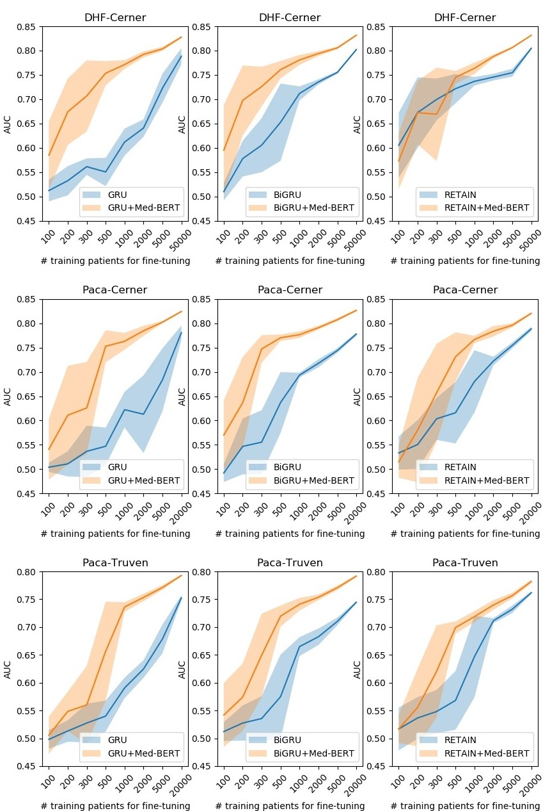

# Med-BERT
This repository provides the code for pretraining and fine-tuning Med-BERT,contextualized embedding model that delivers a meaningful performance boost for real-world disease-prediction problems as compared to state-of-the-art models.

### Overview
Med-Bert adapts bidirectional encoder representations from transformers (BERT) framework pre-training contextualized embeddings for diagnosis codes mainly in ICD-9 and ICD-10 format using structured data from 28,490,650 patients EHR dataset. 
 
Please refer to our paper Med-BERT: pre-trained contextualized embeddings on large-scale structured electronic health records for disease prediction

## Download

We provide our pre-trained models in both Tensorflow and Pytorch versions. Pre-training was based on the original BERT code provided by Google, and pre-training details are described in our paper. 

    Med-BERT Tendorflow vesrion
    Med-BERT Pytorch version (converted using hugging face transformers-cli convert API)
    
## Reproduce Med-BERT
#### Pretraining

To reproduce the steps necessary to finetune BERT or BioBERT on MIMIC data, follow the following steps:

    python data_preprocess.py 
    python create_ehr_pretrain_data.py
    python run_EHRpretraining.py

#### Finetuning Tutorial

To see an example of how to use Med-BERT for specific disease prediction, you can follow the [Med-BERT DHF prediction notebook]

Kindly note that you need to use the following code for preparing the finetunning data:
    python create_ehr_pretrain_FTdata.py

### Dependencies
    Python: 3.7+
    Pytorch 1.5.0
    Tensorflow 1.13.1
    Pandas
    Pickle
    tqdm
    pytorch-transformers
    Google BERT
    

### Contact

Please post a Github issue if you have any questions.

### Citation

Please acknowledge the following work in papers or derivative software:
[to add citation here]

